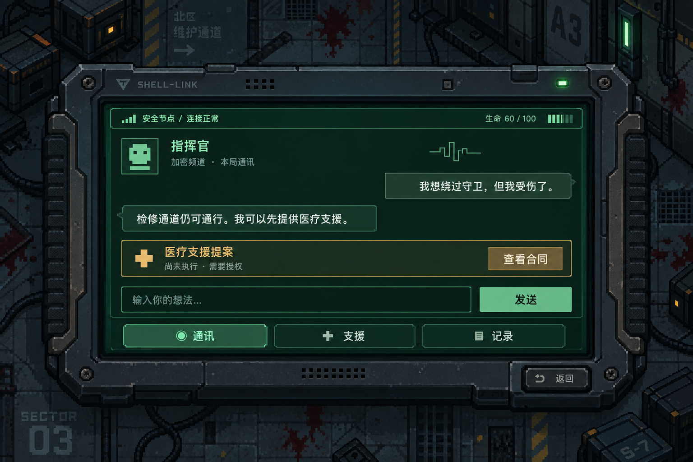

# AI 指挥官与战术平板 · 阶段任务列表

整理日期：2026-09-23。状态：**用户已授权启动本阶段；派发与集成进度见[状态台账](STATUS.md)。**

详细实施见[开发规范](DEVELOPMENT.md)、[并行执行计划](EXECUTION.md)和[主控提示词](ORCHESTRATOR_PROMPT.md)。

本阶段只考虑核心游戏程序系统与已确认的手机 UI，不制定演示路线、讲解脚本或评分展示流程。原 UI-01 已停止并归档，不自动恢复。本轮以 UI-02 明确承担设计与资源工作。

## 1. 阶段目标与优先级

玩家在游戏首页配置兼容 `/v1/chat/completions` 的服务，进入游戏后在安全节点打开平板，与基于当前游戏状态的 AI 指挥官交流。AI 可提出医疗或弱点解析建议，经 Unity 校验与玩家确认后执行真实支援。

本轮极致速度优先，复用现有游戏、网络请求、支援与字体组件，不编写或运行自动测试，不设中间验收，只保留交付前人工校验。正常导入／编译错误直接在开发中修复，不另起检查任务。不引入 Agent 框架、完整测试套件、全面回归、额外服务器或演示专用玩法。

## 2. 已确认的功能边界

### 2.1 首页与 LLM 接入

- 所有 LLM 请求、上下文拼装、响应解析和错误处理均在 Unity C# 中执行，直接访问用户配置的服务，不依赖独立代理后端。
- 仅支持 OpenAI-compatible `/v1/chat/completions`。首页配置 API Base URL、API Key、模型 ID，提供测试连接、开始游戏及离线试玩。
- 服务暂定 DeepSeek V4 Flash；这是用户暂定选择，实际 API 模型 ID 可配置，不猜测或写死尚未核验的模型 ID。
- Base URL 与模型 ID 本机保存；Key 掩码输入，仅存当前程序运行的内存，重开本局保留，退出程序清除。不写入日志、场景、资源包或仓库。
- 测试连接不进入本局聊天与叙事，也不产生支援提案。
- 请求超时可配置，默认15秒；首页和游戏内共用，不受战斗暂停影响。
- 不做 LLM 主动查询、查询工具、function calling 查询循环或模型自主获取游戏数据。

### 2.2 状态与对话

- 每次发送附带最新状态和最近6轮对话；一轮指玩家消息与对应AI回复。实现时避免把当前输入重复加入历史。
- 状态仅含当前生命、任务目标、已发现记忆、已知路线及其通行情况、当前Boss阶段、可用支援、合法记忆／授权档位及近期有效行为。
- 不发送未发现剧情、未知隐藏路线、未来结局；路线来自已配置说明，不做实时寻路。
- 重开清空聊天，不做跨局对话保存、自动摘要、长期记忆。
- 玩家口头偏好可影响推荐，但不等于授权，不替代合同确认。超出6轮窗口的偏好不承诺永久记住。
- 同一时间只允许一个请求；等待时可滚动聊天、查看记录，发送禁用，可取消。完整响应校验后一次展示，不做流式输出。

### 2.3 提案与支援

- 模型输出对白与可选提案，类型仅为：无、医疗、弱点解析。
- 模型只能推荐请求中提供的合法记忆和授权档位，不能指定任意伤害、生命增量、同步分数或权限。
- 支援效果、合同文字和代价由 Unity 配置生成。没有符合条件／玩家意愿的选项时，只回应原因，不生成合同。
- Unity 校验模型输出后才展示提案。格式无效不执行动作，保留原输入以便重试。
- 提案嵌在聊天中，点击“查看合同”才在平板内覆盖显示合同，不自动切页。
- 合同列支援效果、涉及记忆、授权范围和同步度变化；按钮为“接受并执行”“拒绝”。关闭合同等同取消本次提案，返回原聊天位置。
- 点击查看合同与接受时都重查最新条件。已执行、拒绝或取消的提案不能再次执行；失效时明确显示，玩家可重新询问。
- 暂停期间确认支援立即生效并刷新显示：医疗回血、弱点解析增加核心窗口；窗口倒计时仍冻结，关闭手机后续计时。
- 实际效果由 Unity 追加到聊天，如实际回血量、同步变化或失败原因，并随下一次请求提供。执行后不自动再请求LLM。
- 手动支援和预设通讯继续可用，网络失败不影响它们；成功才提交代价，失败／拒绝不收费。

### 2.4 手机、暂停和安全节点

- 所有打开游戏内手机的入口均暂停战斗，包括通讯、支援、记录和合同。关闭手机后恢复之前进度与开火选择。
- 冻结角色／敌人移动、伤害、弹丸、攻击冷却、Boss核心窗口、Buff持续时间及关卡计时。
- 手机UI、网络请求、请求超时仍正常运行。暂停是可操作状态，不应被当作死亡或整局结束而拒绝支援、清理弹丸或重置Boss。
- 不显示“战斗已暂停”文字，通过背景变暗和世界停止体现。
- 自由输入仅在安全节点开放；**只要位于安全节点即可输入，不再因附近敌人而禁用**。非安全节点可阅读和使用手动支援，输入禁用并给出位置原因。
- 关闭手机取消未完成请求，迟到回复丢弃。不能取消已经实际完成的支援，也不能因为关闭结局手机重新启动已结束战斗。
- 重开取消请求、清空聊天／提案／合同、重置战斗与暂停状态；旧局响应不能进入新局。API配置与当前程序内Key保留。

### 2.5 失败行为

- 等待显示“指挥官正在回应”，允许取消。
- 超时、断网、服务错误、格式无效时保留输入并提示手动重试，不自动重试。
- 失败输出不能触发支援。预设通讯和手动支援继续可用，不能把本地回应冒充在线AI结果。
- 同一份提案与合同须防重复提交；晚到响应依据请求代次和本局身份丢弃。

## 3. 已确认的视觉参考

用户已认可 [ImageGen战术平板草图](References/tactical-tablet-concept.png)。布局源为 [SVG](References/tactical-tablet-layout.svg)，生成说明为 [提示词](References/tactical-tablet-prompt.txt)。这些仅是概念参考，不是已经切分或接入的最终资源。

- 居中的横向战术平板，厚重像素外壳、切角、有限磨损、绿色终端屏幕、琥珀色授权提示、底部触控导航、实体返回键。
- 背景保留变暗的游戏世界；不回到原战斗中右侧窄面板，也不加暂停文字。
- 通讯、支援、记录三个主入口，常驻关闭／返回入口。
- 通讯页连续聊天与底部固定输入框；支援提案为聊天内卡片，合同为屏幕内覆盖窗口。
- 专门的资深游戏UI/UX设计任务负责后续设计与资产，使用内置ImageGen；按真实组件需要生成外壳、局部装饰等资源，并实际用于Unity。
- 文字、合同、数值、消息和点击区域由原生UI承载，不烘焙进整张图片。沿用现有uGUI/TMP及中文字体，保证中文、长文本滚动和状态可读。

## 4. 对旧需求的覆盖

| 旧设计／实现 | 本阶段最终要求 |
| --- | --- |
| 手机不暂停战斗 | 所有游戏内手机入口暂停战斗与相关计时 |
| 战斗展开窄面板 | 居中横向战术平板大面板 |
| 自由输入还需附近无敌人 | 安全节点位置有效即可，不再因敌近禁用 |
| 客户端只调用代理，Key只能服务器持有 | 本轮明确改为用户在首页输入自己的Key，C#直连，Key仅内存持有 |
| AI工具主动查询状态或路线 | 每次请求附带状态，不实现主动查询 |
| 固定文本代理响应 | 对白＋有限支援提案，由Unity校验及确认 |
| 收到提案直接切页或执行 | 聊天内卡片，主动查看合同，确认后执行 |

此覆盖仅限本阶段，不把全服叙事、外置手机等长期愿景删除或自动列为开发项。实施前同步触及文件的注释和说明，防止旧“不暂停／仅代理”规则再次被误用。

## 5. 阶段任务列表

各任务实时状态见[状态台账](STATUS.md)。路径和类型名为实施建议，采用启动时实际集成基线，不使用本轮讨论早期的旧SHA。

| ID | 任务与具体交付 | 前置 | 修改边界 |
| --- | --- | --- | --- |
| AI-00 | 快速核对最新NativePhone/Hud、支援、暂停和网络代码；冻结最小请求／响应、状态快照、提案ID与会话代次约定，确定首页与主场景接入点 | 阶段启动授权 | 小型契约与状态说明；不重做全仓审计 |
| AI-01 | C#直连客户端：Base URL／模型／Key、非流式POST、15秒默认超时、取消、单请求、错误解析；仅地址／模型持久化；连接检查 | AI-00 | 独立网络／配置目录；不改手机布局和支援业务 |
| AI-02 | 游戏状态快照、已知内容过滤、6轮历史、有限响应解析、提案合法集合、请求代次／重开隔离；提供手机可绑定状态 | AI-00；联网联调依赖AI-01 | 独立Commander会话层；不直接改生命和分数 |
| AI-03 | 提案→合同桥接：两次条件校验、合法记忆／档位、合同确认／拒绝／取消、终态去重、真实执行结果追加聊天 | AI-00；接入AI-02 | 支援适配层；现有Support必要改动由该任务独占 |
| AI-04 | 手机暂停所有战斗计时、恢复、暂停中支援可用、UI与网络不冻结、全入口处理、安全节点取消敌近限制、重开恢复与终局保护 | AI-00 | 暂停状态／NativeRunController、战斗时钟和安全节点；UI调用点由集成任务接入 |
| UI-02 | 资深游戏UI/UX按已认可草图补齐合同／错误／禁用／等待状态，ImageGen生成最少必要最终资产，交付像素导入／切片说明、布局及组件规范 | AI-00可并行；以已认可视觉为基础 | 新美术资源和设计目录；不得恢复旧UI-01；不改共享场景 |
| UI-03 | 原生uGUI平板与首页配置落地：三入口、聊天滚动、输入／发送／取消、提案卡片、合同覆盖、长文本与失效状态、测试连接／离线进入；动态文字保持真实数据绑定 | AI-00、UI-02；可先搭功能框架 | UI Prefab／新增UI控制器；NativePhone/Hud最终改动由单一负责人完成 |
| INT-AI | 串行合入并接线：AI请求、状态、合同、暂停、首页、重开；准备最后人工校验，交付可运行程序代码／资源与简短使用说明 | AI-01～04、UI-02～03 | 共享NativePhone/Hud、场景、公共资产最终保存；保留其他开发者修改 |

AI-01首选复用已有UnityWebRequest超时／取消机制，改造协议层。开源SDK调研仅为参考，未决定必须引入某一SDK；不要为了简单文本请求追加大型依赖链。实际选型由执行任务按最快兼容路径决定，协议与产品行为不变。

## 6. 并行与集成方式

- 沿用 [指定主控任务](codex://threads/01a0ca99-e997-7733-9a45-d4ee7b146ff8) 的独立task thread模式，不使用subagent或嵌套代理。本文件不发送派发消息、不创建任务。
- 执行任务采用 `gpt-6-sol`、`thinking: xhigh`，要求请求级 `service_tier: priority`；核验实际配置，不能用prompt代替设置，也不向不支持的工具传伪造参数。
- 并发数量由主控按最新用户授权和资源状况安排，不照搬早期5线程上限；不为填满名额拆零碎任务。Unity操作与共享场景保存始终串行。
- 第一批：AI-00只冻结必要接口，随后AI-01、AI-02、AI-04、UI-02并行；AI-03可基于已冻结契约并行开发，等待会话层后联调。
- 第二批：UI-03采用已有资产与契约接入，不重复实现提案状态或支援判定；INT-AI逐步集成。
- NativeHud／NativePhone为冲突热点，AI、暂停与UI任务通过独立组件提供入口，最终由一个集成写入者接线。既有工具包的Run／Scope／多Boss支援适配必须保留。
- 设计阶段不重做多方向探索。已有SVG和ImageGen草图直接复用，只补实际缺少的合同与状态设计，最终素材以少量高价值资源为主。

## 7. 最后人工校验与交付

按用户最新要求，原先独立的最小检查安排取消：不写／不跑自动测试，不创建探针、测试夹具或中间验收关口。开发中修复实际导入、编译与接线错误，功能合入后只做一次人工校验。

人工核对首页配置与真实联网、手机暂停／恢复、提案合同与真实支援、取消／重开隔离及UI可操作性；具体短清单见[执行计划](EXECUTION.md)。不是演示流程，不要求穷举异常、全量主线回归或跨平台检查。

交付代码／资源、启动入口、配置方式和简短使用说明。人工未操作时如实标记“待人工校验”，不虚报通过，不因等待人工而延迟代码交付。没有API凭据时由用户在首页输入，不通过聊天收集Key。

## 8. 本阶段明确不做

演示流程和评分展示脚本；LLM主动查询；实时寻路；流式响应；后台自动重试／复杂熔断恢复；跨局聊天、自动摘要、长期记忆、Key持久化；新支援机制；模型直接决定分数／结局；外置手机、全服服务、ARG、存档系统；重做地图／Boss／装备；完整测试矩阵。

网络页当前内容可收纳进“记录”，仍明确真实联网范围只指AI通讯，不把AI连接成功显示成全服网络已上线。
