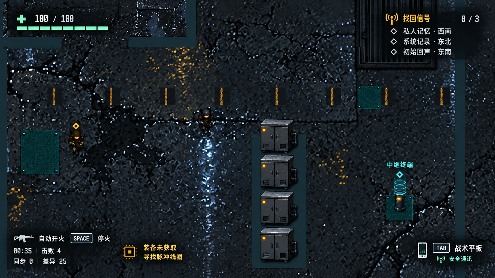

# GF02 局内 HUD 已确认设计

确认日期：2026-09-23。状态：**视觉方案已采纳，待后续实施**。

用户确认：“可以，先采纳方案”。本次只归档设计，不授权立即修改代码、场景、预制体或运行时资源，不代表实现或人工复测通过。

## 范围与审阅图

本方案针对局内 HUD。用户上一条需求中提到“主菜单”，但截图和问题均为局内画面；已说明按局内 HUD 处理，并获得本次确认。主菜单继续沿用另行确认的雨夜城市方案，不将主菜单标题、CipherWorks 标识或背景动画搬入战斗 HUD。

- [采纳的第二版草图](References/HUDReview/hud-v2-approved.png)
- [用户提供的修改前截图](References/HUDReview/hud-before-user-capture.png)

图像是布局和美术方向参考，不是完整运行界面，也不是可直接覆盖游戏的整屏素材。生成过程中环境细节有变化；不据此修改关卡、角色、物体位置或玩法。第一版厚重金属框方案未采纳。

## 已确认的设计方向

移除左上角“壳中回响 / 信号01”标签。采用与现有工业废墟、冷青绿像素画面一致的轻量 HUD，减少大块黑底、厚金属边框、螺丝、磨损装饰和重复提示，把中心区域留给战斗。

| 区域 | 内容与层级 | 表现 |
| --- | --- | --- |
| 左上 | 生命数值与血条，最高优先级 | 小型医疗十字、亮色数值、窄薄青绿血条；血条刻度仅为视觉分段，不修改生命规则 |
| 右上 | 找回信号、实际进度、三项地点线索 | 琥珀色标题、浅色线索、紧凑菱形标记；不用厚框 |
| 左下 | 开火状态、Space 操作提示、用时、击败数、同步与差异 | 小型武器图标、按键框、统一字级和行距；统计信息弱于开火状态 |
| 左下相邻区域 | 装备状态及当前获取提示 | 小型芯片图标与短文本，不增加独立大面板；文案随真实状态更新 |
| 右下 | Tab 战术平板入口与通讯可用性 | 平面像素平板图标、小型按键框和短文本；不得把安全通讯误示为 LLM 已联网 |
| 世界空间 | NPC、终端等交互对象 | 小型标记、必要短标签，减少长期悬浮的大段名称；距离与交互提示依实际逻辑显示 |

草图数值（100/100、0/3、00:35、击败4、同步0、差异25）仅为示例，实施时绑定真实状态。不得新增草图之外的弹药、魔力、技能、地图等系统。

## 后续实施建议

以下参数为实现起点，需实际画面复测，不表示已验证：

- 主色取现有沥青蓝黑、暗青灰；关键文字用偏冷白，生命用浅青绿，目标强调用琥珀色。高饱和色只承担状态或操作含义。
- 采用统一逻辑像素网格、清晰像素图标及现有可读中文像素字体；常态装饰线控制在 1–2 个逻辑像素。避免写实手机图标与平面 HUD 混用。
- 16:9 草图四周约 4% 安全边距作为起点。各组信息紧凑对齐，不用四个同样大小的卡片填满四角。
- 噪声地面上的文字用局部暗底或短阴影保证对比，避免依赖大面积发光。分辨率变化时保持字形清晰，允许调整容器宽度与换行。
- 文字、数值、图标、血条与局部衬底分别制作和绑定；不要将生成图里的文字烘焙成运行时界面。
- 原截图右侧无标签橙条未在草图保留；其实际用途尚未核实。后续先定位真实功能，如承载玩法信息，应重新设计并保留信息，不可仅凭草图删除。

## 参考来源与取舍

2026-09-23 查阅的像素游戏实机截图参考如下。借鉴信息组织和像素表现，不复制其素材或独有图标。

| 参考 | 借鉴重点 |
| --- | --- |
| [Hyper Light Drifter 实机截图](https://www.gamestar.de/galerien/hyper_light_drifter%2C97238.html) | 紧凑状态条、少量符号、战斗区域留白 |
| [Eastward 实机画面](https://www.pcgamer.com/eastward-review/) | 像素图标、信息分组、UI 与场景风格协调 |
| [UNSIGHTED 实机画面](https://playcritically.com/2023/06/17/unsighted-review/) | 动作游戏状态信息层级与紧凑布局 |
| [ZERO Sievert 实机画面](https://www.pcgamer.com/this-top-down-shooter-is-like-stalker-as-a-roguelike/) | 顶视角射击场景中的克制 HUD 和情境提示 |

## ImageGen 生成记录

使用内置 image-gen 工具生成，不是 CLI/API 回退。第二版以第一版生成草图为编辑输入，第一版基于用户原截图。归档保留原截图和采纳图；下列为生成提示词的中文整理版，不是逐字工具日志。

> 编辑局内 HUD 草图为更精致的真实像素游戏界面。保留俯视工业场景、角色、柜体、终端和玩法内容。输出单张 16:9 游戏画面，不含编辑器栏、红色标注或说明文字。参考 Hyper Light Drifter、Eastward、UNSIGHTED、ZERO Sievert 的紧凑信息组织，使用原创像素图标和清晰字级。移除厚重写实金属板、螺丝、磨损玻璃、渐变和发光边框，改用少量 1–2 像素轮廓、局部暗底与文字阴影。左上医疗十字、100/100 和窄青绿血条；右上找回信号、0/3、私人记忆·西南、系统记录·东北、初始回声·东南；左下武器图标、自动开火、SPACE 停火、00:35、击败4、同步0、差异25，相邻处小芯片图标及装备未获取、寻找脉冲线圈；右下平面像素平板图标、TAB 战术平板和安全通讯。保留 NPC 琥珀菱形与终端青色标记；移除壳中回响/信号01、品牌标题、大型装饰橙条与巨大地点标签。不得新增弹药、魔力、地图或技能系统。使用暗蓝黑、浅青绿、暖白和少量琥珀色，优先阅读性与战斗视野。

## 后续人工复测项（全部待执行）

- 左上旧标题完全移除，生命信息无重叠且随伤害、恢复正确变化。
- 明暗不同的场景区域下文字可读；16:9、16:10 与较低分辨率无裁切、遮挡或不可读缩放。
- 任务进度、线索、装备提示、计时、击败数与同步/差异均来自真实状态。
- 开火切换、Tab 提示与实际行为一致；安全/危险、已配置/联网结果不混淆。
- 交互标记显示范围正确；中央战斗区不被 HUD 大面积遮挡。

归档验证只检查文件与文档链接，不执行 Unity 编译、Play 或游戏测试。
