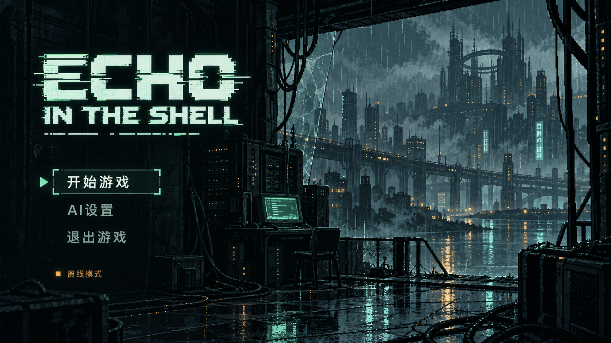

# GF02 主菜单美术方向记录

日期：2026-09-23。状态：**方向已确认；动态草案已生成，正式分层资产、动画精修与 Unity 接入待实施。** 对应 [GF02-002 / 003](REQUIREMENTS.md)。

## 用户确认与范围

用户批准首版草图后，要求背景使用 image-gen 制作帧动画，并在右下加入 CipherWorks 队伍 Logo；看过动效草案后表示“上面的制作方向就先这样”。本记录保存方向与预览，不声称正式动画质量已验收。

主菜单仅有“开始游戏 / AI设置 / 退出游戏”三个主入口；不增加继续、存档、商城等功能。中文游戏标题移除，英文仅使用 **ECHO IN THE SHELL**。菜单操作仍使用中文。

## 归档资源

- [已确认的静态方向](References/MainMenuReview/main-menu-approved-direction.png)
- [含 CipherWorks 的四帧动效草图](References/MainMenuReview/main-menu-motion-four-frames.png)
- [可播放预览 HTML](References/MainMenuReview/main-menu-motion-preview.html)：自包含图片，可在浏览器打开，支持暂停、逐帧与 3 / 5 / 8 FPS；这些帧率只是预览选项。

静态首版尚无 CipherWorks；其位置和初步造型见四帧草图。此处是队伍标识提案，不代表独立品牌系统或已交付透明 Logo 资产。

## 视觉与动效规范

主题为“雨夜 · 信号残响”：左侧清晰英文像素 Logo 和菜单，右侧废弃网络终端、雨幕、湿地倒影与远处城市形成纵深。氛围冷峻、安静；图形语言参考《攻壳机动队》的科技氛围和赛博朋克题材，保持原创字形。

- Logo：ECHO 大字在上，IN THE SHELL 在下，主字形清晰；少量断线和像素错位表达回声，避免过度故障效果。
- 配色起点：深蓝黑 `#071116`、暗青 `#163332`、荧光青绿 `#70DDB4`、冷白 `#D8F5E8`、少量琥珀 `#C79050`。这些是设计参数，不是已导入的 Unity 色值。
- 主入口：“开始游戏”亮青白文字，小箭头和细选中框；其他入口降一级亮度但仍可读。所有交互状态需后续明确实现。
- 队伍标识：右下小型原创 C/W 电路线条图形与精确文字 **CipherWorks**，保持边距和较低视觉权重。
- 动态范围：雨丝、积水涟漪与倒影、少量终端灯光；标题、菜单、标识、镜头及建筑轮廓稳定。避免全屏闪烁。
- “离线模式”仅是草图示例，运行时绑定真实状态，不据配置存在宣称联网成功。

## 动画限制与后续制作

内置 image-gen 生成了 2×2 四帧图集；HTML 使用图集位置切换播放，并以首帧区域覆盖保持 UI 和标识稳定。这不是已完成的 Unity 动画或正式背景序列。局部生成细节仍有漂移、帧数较少，正式资源需分层后精修一致性及循环接缝。

后续将背景、动态区域、英文 Logo、队伍 Logo、原生菜单文字分别制作；不要把整屏文字烘焙进背景，也不要直接把四格图当单张背景导入。保持原场景功能，动画帧数与时长由效果复测后决定。

## 参考来源

- [Michael Rigley 的 Cyberpunk 2077 视觉开发](https://www.michaelrigley.com/work/cyberpunk-2077)：标题与屏幕视觉语言参考。
- [Rob Ogden 的 Secrets & Lies](https://www.rob-ogden.com/secrets-and-lies)：场景化菜单与主次高亮参考。
- [SIGNALIS 截图资料](https://www.mobygames.com/game/193717/signalis/screenshots/)：简洁标题画面与留白参考。

## 生成提示词记录（整理版）

使用内置 image-gen，非 CLI/API 回退。以下为可复用的中文约束摘要，不是逐字工具日志。

**静态草图：** 生成一张 16:9 像素赛博朋克游戏主菜单。废弃网络中继室望向雨夜城市，暗色前景、线缆、终端、湿地倒影及深远城市轮廓；左侧约42%留给原创英文像素标题 ECHO IN THE SHELL 与菜单。深蓝黑、暗青、荧光青绿、冷白和少量琥珀色；像素簇清晰，克制抖色与辉光。菜单精确为开始游戏、AI设置、退出游戏，首项选中，亮色文字不可为黑色；下方小型离线模式提示。不含中文游戏标题、额外入口、装饰性遥测或营销文案。

**四帧编辑：** 以批准静态图为输入，生成无间隔、无编号的2×2等尺寸四帧图集，每格完整16:9菜单。镜头、建筑、人物物件、Logo和UI对齐固定，仅雨滴位置、地面涟漪、倒影亮点和终端灯少量变化。每帧右下加入一致的小型原创C/W电路线条标识及CipherWorks字样；边距约5%，低于主标题视觉权重。保持标题、中文菜单和离线状态准确，禁止建筑变形、新物体、闪电、全屏亮度突变。

## 待复测

英文拼写、主按钮可读性、动静分层、循环接缝、像素一致性、帧间稳定、亮度舒适度、各比例缩放、安全边距及三个入口行为均待实际接入后检查。仅完成设计资料归档，无 Unity 验证结论。
